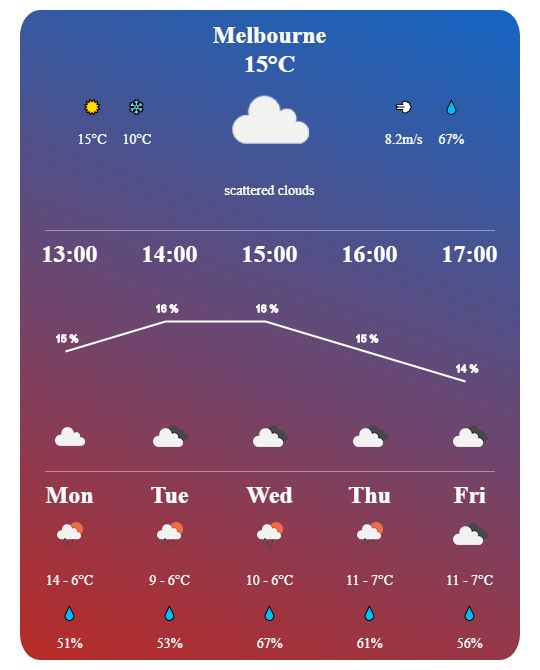
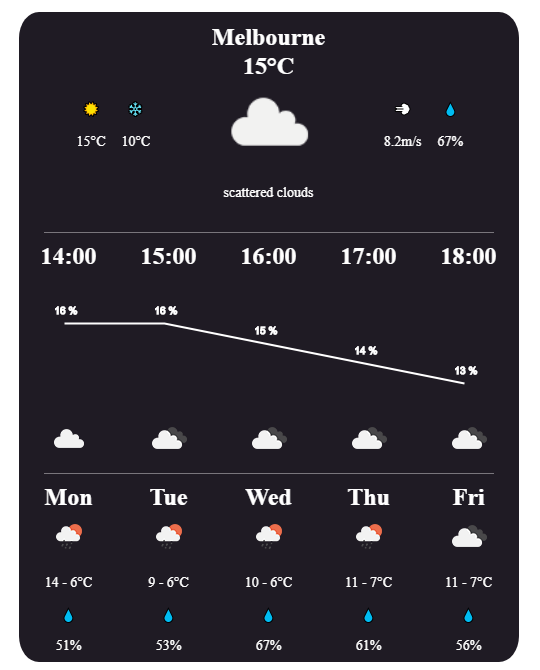

# react-openweather-widget

A nice weather widget for react based on openweather - [Demo](https://eggtronic.github.io/react-openweather-widget/)





---
#### Feature
- Light Weight - the only peer dependency is styled-components
- Typescript Support
- Customizable Theme
- Geo Detection - detect you geo location by default

#### Note
- It requires a peer dependency of styled-components
  ```
  npm install --save styled-components
  ``` 

#### Usage
- Basic 
  ```JSX
  import React from 'react';
  import WeatherWidget from '@eggtonic/react-openweather-widget';

  function Basic() {
    const key = 'xxx'; // your openweathermap api key

    return (
      <WeatherWidget apiKey={key} />
    );
  }
  ```
- Theme
  ```JSX
  import React from 'react';
  import WeatherWidget, {
    darkTheme,
    lightTheme,
    defaultTheme
  } from '@eggtonic/react-openweather-widget';
  function Theme() {
    const key = 'xxx'; // your openweathermap api key

    return (
      <WeatherWidget 
        apiKey={key} 
        theme={darkTheme}
      />
    );
  }
  ```

- Customize Theme
  ```JSX
  import React from 'react';
  import WeatherWidget from '@eggtonic/react-openweather-widget';
  function CustomTheme() {
    const key = 'xxx'; // your openweathermap api key
    const theme = {
      color: ['#b92b27', '#1565C0'], // graient color of background
      width: '500px', // widget width
      height: '650px', // widget height
      mainFontSize: '24px', // main text size
      subFontSize: '14px', // sub text size
      mainFontColor: '#fff', // main text color
      subFontColor: '#fff', // sub text color
      hrColor: '#fff', // hr line color

      // line chart styles
      lineChartPadding: [45, 30],
      lineChartLabelPadding: [-10, -10],
      lineChartColor: '#fff',
      lineChartLabelColor: '#fff',
      lineChartLabelSize: 1,
      lineChartHeight: '120px'
    }

    return (
      <WeatherWidget 
        apiKey={key} 
        theme={theme}
      />
    );
  }
  ```
- Others
  ```JSX
  import {
    WeatherHeader, 
    WeatherHourly, 
    WeatherDaily,
    LineChart
  } from '@eggtonic/react-openweather-widget';

  // you can use those child components independently
  ```
---
#### 📝 Props
| Name         | Type    | Default | Description |
| ------------ | ------- | ------- | ----------- |
| className | string |  | Additional CSS class for the root DOM node |
| apiKey | string | | Your api key from [OpenWeatherMap](https://openweathermap.org/) |
| geo | `{lat: string, lon: string}` or `undefined` | undefined | Widget detects your geo by default, you can also specify your own geo location |
| theme | [WeatherWidgetTheme](./src/types/weatherWidget.ts)| [defaulTheme](./src/theme.ts) | Customize theme |
| exclude | [OpenWeatherMapExclude](./src/types/weatherWidget.ts) | undefined | OpenWeatherMap api config, exclude daily/hourly/current wealther data|
| dayRange | [number, number] | [1, 6] | Specify how many days' weather to display (start from next day)|
| hourRange | [number, number] | [1, 6] | Specify how many hours' weather to display (start from next hour)|
| children | ReactElement[] | undefined | React children|

---

#### 🔨 Development
```
npm run install
npm run storybook
```

#### 🧪 Test
`npm run test`

#### 🔧 Build
`npm run build`


## License

MIT © [EggTronic](https://github.com/eggtronic)
